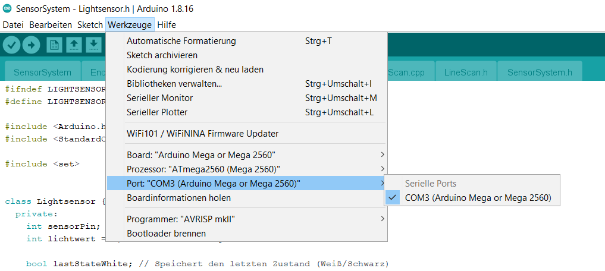

# SensorSystem
Development of a sensor system and data processing framework for an Arduino Mega using a line scan sensor, light sensor, and encoder. Implementing Arduino C++ and Python code to interface sensors, process data, and ensure reliable communication with a Raspberry Pi 5.
## Anleitung
Für eine detaillierte Anleitung zur Nutzung und Einrichtung dieses Projekts, siehe [Anleitung](Anleitung.pdf).
## Anforderungen
Dieses Projekt erfordert die Installation der `StandardCplusplus`-Bibliothek. 

### Installation der `StandardCplusplus`-Bibliothek
Lade die Bibliothek herunter und füge sie deinem Projekt hinzu. Du kannst die Bibliothek von folgendem Link herunterladen: [StandardCplusplus herunterladen](https://github.com/maniacbug/StandardCplusplus).

Alternativ kann die Bibliothek durch eine andere Bibliothek ersetzt werden, die den Datentyp `<set>` unterstützt.

## Setup:
Achte darauf, dass  hier das richtige board und port ausgewählt wird. Der entsprechende Port muss auch in PyConnection - Gesamtsystem angegeben werden.

